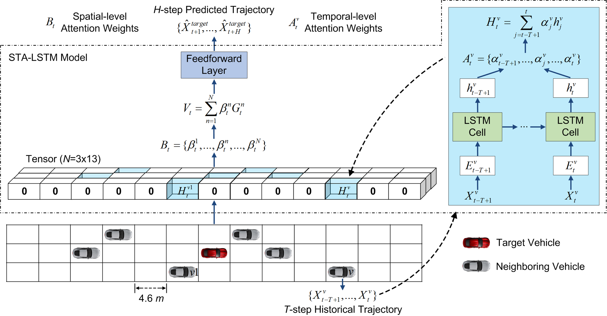
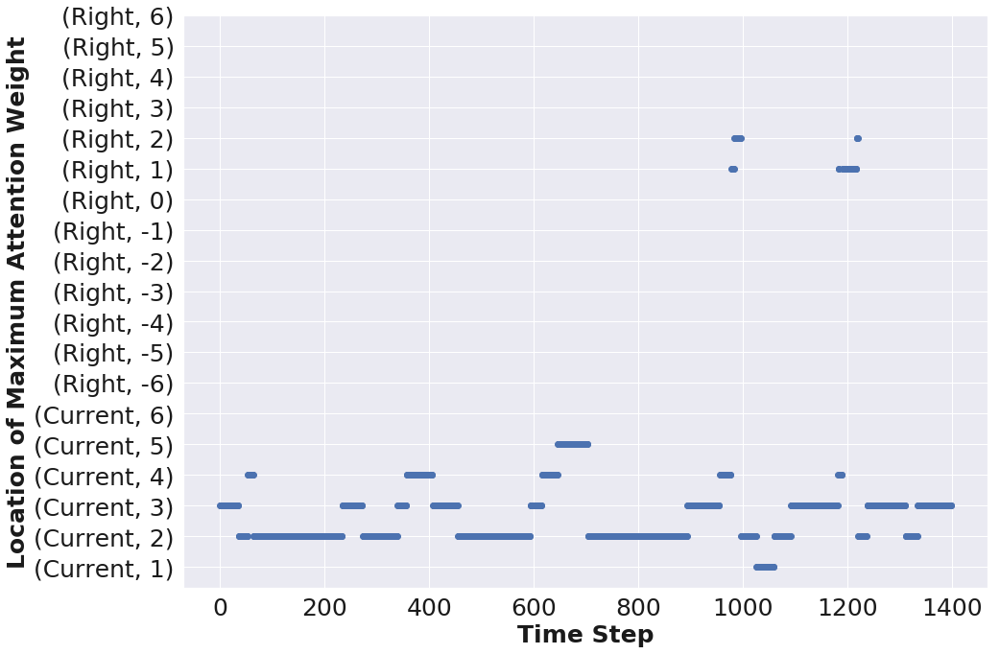

# VTP: Vehicle Trajectory Prediction with Deep Learning Models

## Data:
The training/val/testing datasets extracted from NGSIM can be dowloaed from [here](https://drive.google.com/open?id=1dFMpX8HeCradMaCh4h0bD60h8k3M65Fw).

## STA-LSTM: An LSTM model with spatial-temporal attention mechanisms
- STA-LSTM utilizes *T*-step historical trajectories of all vehicles within a 3×13 grid centered around the target vehicle to predict its future trajectories. The architecture of STA-LSTM is shown below:

  

### STA-LSTM achieves comparable prediction performance against other state-of-the-art models:

<table>
<tr>
<td rowspan=2>Models <td colspan=5>RMSE per prediction time step
<tr>
<td colspan=1>1 <td colspan=1>2<td colspan=1>3 <td colspan=1>4 <td colspan=1>5
<tr>
<td colspan=1>physics-based model <td colspan=1>0.1776 <td colspan=1>0.3852 <td colspan=1>0.6033 <td colspan=1>0.8377 <td colspan=1>1.0888
<tr>
<td colspan=1>naive LSTM <td colspan=1>0.1012 <td colspan=1>0.2093 <td colspan=1>0.3384 <td colspan=1>0.4830 <td colspan=1>0.6406
<tr>
<td colspan=1>SA-LSTM <td colspan=1>0.1026 <td colspan=1>0.2031 <td colspan=1>0.3157 <td colspan=1>0.4367 <td colspan=1>0.5643
<tr>
<td colspan=1>CS-LSTM [1] <td colspan=1>0.1029 <td colspan=1>0.2023 <td colspan=1>0.3146 <td colspan=1>0.4364 <td colspan=1>0.5674
<tr>
<td colspan=1>STA-LSTM <td colspan=1>0.0995 <td colspan=1>0.2002 <td colspan=1>0.3130 <td colspan=1>0.4348 <td colspan=1>0.5615

</table>

[1] Nachiket Deo and Mohan M. Trivedi,"Convolutional Social Pooling for Vehicle Trajectory Prediction." CVPRW, 2018

### Average temporal-level attention weights of previous 6 time steps:

  

### Spatial-level Attention weight analysis

- Distributions of spatial-level attention weights by target vehicle class (excluding weights in the target vehicle's cell):

  

- Averaged spatial-level attention weights by the number of neighboring vehicles:

  

- Maximum spatial-level attention weight frequency by target vehicle location:

  

- Maximum spatial-level attention weights regrading the lane-changing behaviors of the target vehicle 2858:

  

