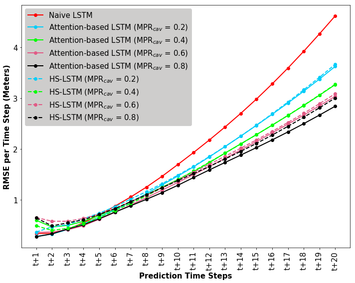
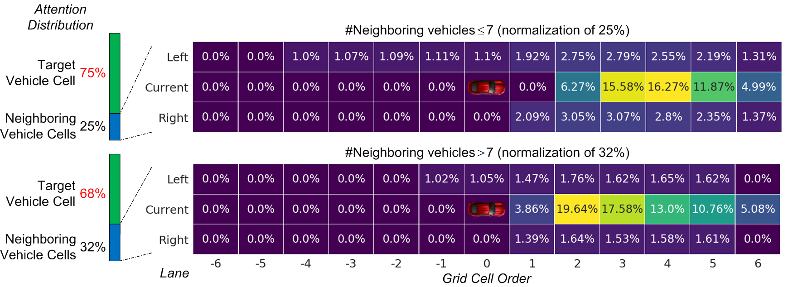
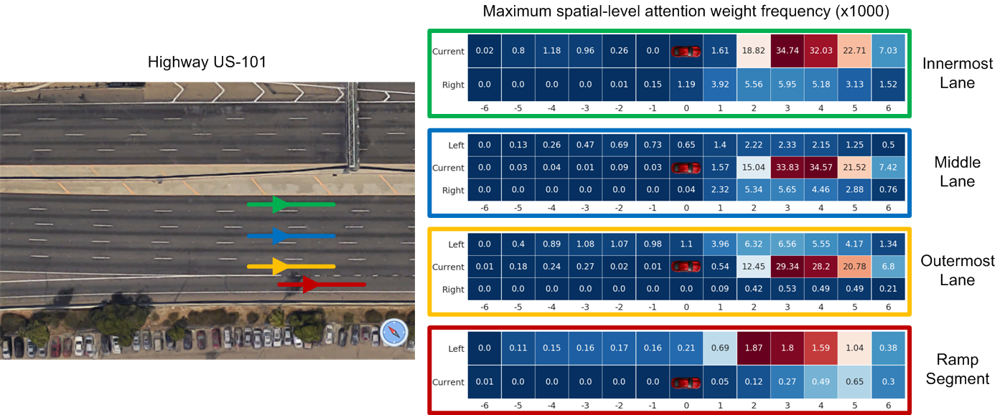

# VTP: Deep Learning for Vehicle Trajectory Prediction

## Attention-LSTM: An LSTM model in a Mixed Traffic Flow Environment (Connected and Autonomous Vehicle, Human-driven Vehicle)
- Attention-LSTM assumes a Connected and Autonomous Vehicle (CAV) utilizes all the CAVs within its communication range (the front and back 200 meters in the left, middle and right lanes) to predict future trajectories of a target Human-driven Vehicle (HDV). 

- Data: The training/validation/test datasets extracted from [Next Generation Simulation (NGSIM) Vehicle Trajectories](https://www.opendatanetwork.com/dataset/data.transportation.gov/8ect-6jqj) can be downloaded [here](https://drive.google.com/drive/folders/1rBm_332tbj4-BaFqf3XndaUH9_YeWjip?usp=sharing).

### Performance of Attention-LSTM under different CAV Market Penetration Ratios

<p align="center">
  
</p>

## STA-LSTM: An LSTM model with spatial-temporal attention mechanisms
- STA-LSTM utilizes *T*-step historical trajectories of all vehicles within a 3×13 grid centered around the target vehicle to predict its future trajectories. The architecture of STA-LSTM is shown below:

<p align="center">
  
</p>

- Data: The training/validation/test datasets extracted from [Next Generation Simulation (NGSIM) Vehicle Trajectories](https://www.opendatanetwork.com/dataset/data.transportation.gov/8ect-6jqj) can be downloaded [here](https://drive.google.com/drive/folders/1dFMpX8HeCradMaCh4h0bD60h8k3M65Fw?usp=sharing).

### STA-LSTM achieves comparable prediction performance against other state-of-the-art models

<table>
<tr>
<td rowspan=2><b>Models</b> <td colspan=5><b>RMSE per prediction time step</b>
<tr>
<td colspan=1><b>1st</b> <td colspan=1><b>2nd</b> <td colspan=1><b>3rd</b> <td colspan=1><b>4th</b> <td colspan=1><b>5th</b>
<tr>
<td colspan=1>physics-based model <td colspan=1>0.1776 <td colspan=1>0.3852 <td colspan=1>0.6033 <td colspan=1>0.8377 <td colspan=1>1.0888
<tr>
<td colspan=1>naive LSTM <td colspan=1>0.1012 <td colspan=1>0.2093 <td colspan=1>0.3384 <td colspan=1>0.4830 <td colspan=1>0.6406
<tr>
<td colspan=1>SA-LSTM <td colspan=1>0.1026 <td colspan=1>0.2031 <td colspan=1>0.3157 <td colspan=1>0.4367 <td colspan=1>0.5643
<tr>
<td colspan=1>CS-LSTM [1] <td colspan=1>0.1029 <td colspan=1>0.2023 <td colspan=1>0.3146 <td colspan=1>0.4364 <td colspan=1>0.5674
<tr>
<td colspan=1>STA-LSTM <td colspan=1>0.0995 <td colspan=1>0.2002 <td colspan=1>0.3130 <td colspan=1>0.4348 <td colspan=1>0.5615

</table>

[1] Nachiket Deo and Mohan M. Trivedi,"Convolutional Social Pooling for Vehicle Trajectory Prediction." CVPRW, 2018

### Average temporal-level attention weights of the past six time steps

<p align="center">
  
</p>

### Spatial-level attention weight analysis

- Distributions of spatial-level attention weights by target vehicle class (excluding weights in the target vehicle's cell):

<p align="center">
  
</p>

- Averaged spatial-level attention weights by the number of neighboring vehicles

<p align="center">
  
</p>

- Maximum spatial-level attention weight frequency by target vehicle location

<p align="center">
  
</p>

- Maximum spatial-level attention weights regrading the lane-changing behaviors of the target vehicle 2858. The target vehicle 2858 executed two lane-changing maneuvers around the 996th and 1220th time steps, respectively. The vehicle relocated the maximum attention from the current lane to (Right, 1) and (Right, 2), as it was preparing to change to the right lane.

<p align="center">
  
</p>

## Questions or Issues
If you encounter any questions or issues, please feel free to open an issue or reach out directly via email at craskoti@vols[dot]utk[dot]edu.

## Citation
You are more than welcome to cite our papers:
```
@Article{Lin2022Attention,
  author = {Lei Lin and Weizi Li and Huikun Bi and Lingqiao Qin},
  title = {Vehicle Trajectory Prediction Using {LSTM}s with Spatial-Temporal Attention Mechanisms},
  journal = {IEEE Intelligent Transportation Systems Magazine},
  year = {2022},
  volume = {14},
  number = {2},
  pages = {197–-208},
  doi = {10.1109/MITS.2021.3049404}
}

@Article{Lin2021Long,
  author={Lei Lin and Siyuan Gong and Srinivas Peeta and Xia Wu},
  title={Long Short-Term Memory-Based Human-Driven Vehicle Longitudinal Trajectory Prediction in a Connected and Autonomous Vehicle Environment},
  journal={Transportation Research Record},
  pages={0361198121993471},
  year={2021},
  publisher={SAGE Publications Sage CA: Los Angeles, CA}
} 

```
